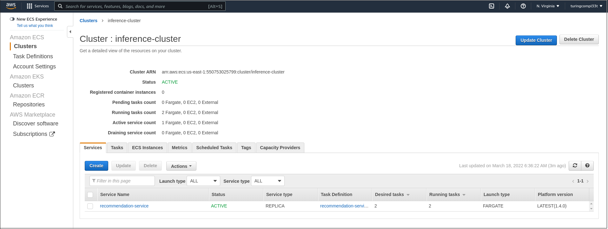
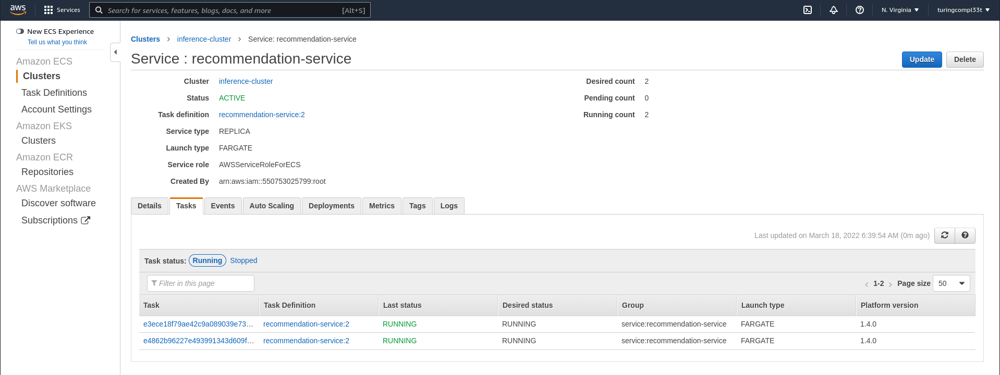
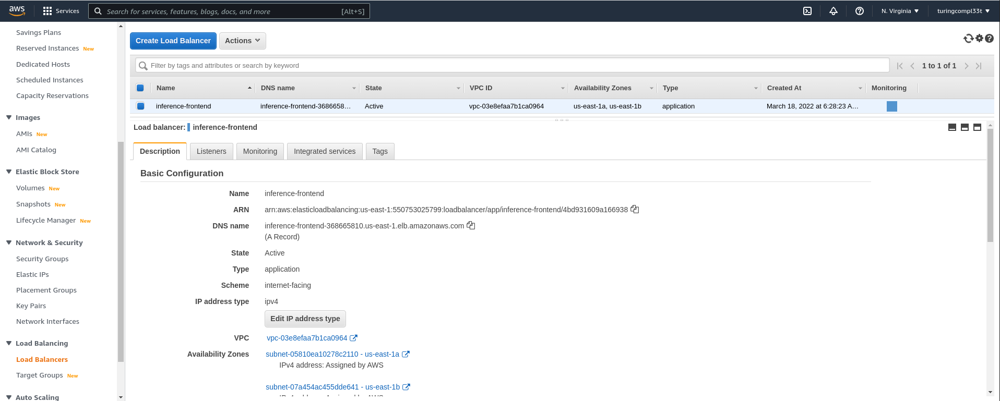

This post describes several options for deploying containerized applicatons on AWS and the tradeoffs in terms of usability, scalability, and pricing.

### Overview

All major cloud service providers present services for deploying containerized applications. Amazon Web Services (AWS) is no exception. In fact, this post was inspired by a [recent article](https://www.lastweekinaws.com/blog/the-17-ways-to-run-containers-on-aws/) that discusses 17 distinct ways to deploy containers on AWS. With all of these available options, how do we select the one that is most appropriate for our particular application?

As you might expect, there are tradeoffs present across these container deployment offerings. The way these tradeoffs align with the particular requirements of our application determines the deployment option we select. In this post, we explore several options for container deployment on AWS, and compare their characteristics that are relevant to making a deployment decision.

We consider _scalability_. These are aspects of the deployment option that influence our ability to handle 

The methods we will consider are listed below, roughly in order of complexity.

- [AppRunner](#apprunner)
- [Lightsail Containers](#lightsail-containers)
- [EC2](#ec2)
- [Lambda](#lambda)
- [ECS](#ecs)

Throughout this post I will use a machine learning inference service as an example application, but the concepts are generalizable to other containerized applications. The inference service in this example provides movie recommendations for users over HTTP(S). An example request to the service looks like:

```
curl https://<PATH.TO.HOST>/recommend/<USER_ID>
```

The expected response is a comma-separated list of movie identifiers.

This post is intended for a (relatively) general audience. I provide an appendix at the end of this post with some additional technical details for those who would like to follow along and try out these services themselves.

### Why Containers?

Containerization takes some additional work beyond development of your application. Why should we bother with containers at all? What problem do they solve?

TODO

### AppRunner

[AWS AppRunner](https://aws.amazon.com/apprunner/) is a fully managed container deployment service. With AppRunner's high-level API, nearly all of the details of infrastructure management are hidden from us. To deploy a container with AppRunner, the only required piece of information is the URI of the image on ECR. The service also provides some options for more advanced configuration of our deployment, including:
- vCPU and Memory
- Autoscaling Policy
- Health Checks 
- Security
- Networking

However, all of these configuration options come set with reasonable defaults. I found that the entire process of deploying an application on AppRunner takes just 30 seconds to click through, but the subsequent deployment of the service can take some time (~3 minutes).

Once the service is running, AppRunner provides us with a public address that we can use to make inference queries:

```
curl https://pbueku8vmz.us-east-1.awsapprunner.com/recommend/0
```

As the [pricing](https://aws.amazon.com/apprunner/pricing/) page for AppRunner explains, we pay for both compute and memory resources used by our application. The page also provides a detailed cost breakdown for some sample workloads. One of these workloads, the _Lightweight, Latency-Sensitive API_ seems particularly appropriate for our use case of a movie recommendation service, and the calculations from AWS estimate the cost of this workload at **$25.50 per month**. This is the cost estimate we will use for AppRunner.

**Benefits**
- The setup for AppRunner is simple and can be completed quickly, without prior experience in cloud computing technologies.
- The AppRunner service provides builtin auto-scaling and load-balancing. This makes scaling deployments of containers on AppRunner extremely simple.

**Drawbacks**
- The configurability of the service is low. AppRunner does not allow fine-grained control of your infrastructure.

automatic re-deployment whenever a new image is uploaded to the respository.

### Lightsail Containers

[AWS Lightsail](https://aws.amazon.com/lightsail/) is a virtual private server (VPS) offering from AWS. Lightsail is similar in some ways to infrastructure offerings (such as EC2) in that it provides direct access to a virtual server in the cloud. However, Lightsail differentiates itself by providing a higher-level API to raw computing resources, presenting a less-involved web interface for new deployments and a simpler pricing model.

Lightsail introduces the concept of _Container Services_ on top of its VPS offering.

```bash
curl https://container-service-1.43f879qo1glao.us-east-1.cs.amazonlightsail.com/recommend/0
```

Features
- no autoscaling
- manual scaling after deployment 
- load balancing among nodes
- multicontainer services
- simple interface for metrics

### EC2

AWS [Elastic Compute Cloud](https://aws.amazon.com/ec2/) (EC2) is the primary infrastructure-as-a-service offering on AWS. This means that with EC2, we are given low-level access to the cloud infrastructure, instead of being presented with a high-level interface to a platform or service offered by AWS.

**Benefits**
- EC2 

**Drawbacks**
- Setting up a container deployment on EC2 requires manual infrastructure provisioning and configuration. Some of these steps can be automated through infrastructure management tools like [Terraform](https://www.terraform.io/).
- As an IaaS offering, EC2 does not automatically provide higher-level functionality such as autoscaling and load-balancing. Scaling a container deployment on EC2 therefore requires significantly more manual effort than other services with a higher-level API.

### Lambda

TODO

### ECS

AWS [Elastic Container Service](https://aws.amazon.com/ecs/) (ECS) is among the most flexible and powerful options for deploying containers on AWS. ECS is similar to [Kubernetes](https://kubernetes.io/) (and therefore the Kubernetes offering on AWS, [EKS](https://aws.amazon.com/eks/)) in that it abstracts the notion of container services away from the underlying resources on which the services run, but it takes a somewhat lighter-weight approach. I find ECS simpler to work with in many respects (e.g. initial setup, management) than EKS, although the tooling available for working with Kubernetes may tip the scales in the other direction.

With ECS, we define our service in (roughly) two stages:
- Describe the containers that implement our application logic
- Describe the resources (compute, memory, storage, etc.) on which we want these containers to run

AWS provides options for deploying ECS services on many different resources, including manually-cosntructed clusters of EC2 instances and a serverless compute option called [Fargate](https://aws.amazon.com/fargate/). Without Fargate, we must manually manage the cluster of instances that run our containers. With Fargate, however, we never work about individual instances, and instead we simply define the resources that our container service needs and allow Fargate to handle the process of allocating these resources for us. This is the approach we will take in our deployment.

With the power and flexibility of this approach comes complexity. Setting up an ECS container service on Fargate requires significantly more configuration effort than the other options for deployment we have seen thus far. For this reason, I find it useful to automate much of the process with an infrastructure automation tool like Terraform. We omit the details here, but see the [appendix](#setting-up-an-ecs-service-on-fargate) for more details.

Once the service is running, ECS provides us with an interface that describes both the cluster as well as all of the services that we have running on it. Currently, we have a single movie recommendation service deployed to the cluster.



We can navigate to the service to see more details, including the definition of individual tasks that run within the context of this service. Each one of these tasks represents a single container instance.



Exposing an ECS cluster to external traffic is slightly more involved than it is for the other services we have explored. The cluster is not available to external traffic by default. Instead, we create an AWS application load balancer that routes external traffic to our cluster. This is available as its own resource on EC2.



Once we have the DNS name from the load balancer, we can hit the service with requests:

```bash
curl http://inference-frontend-368665810.us-east-1.elb.amazonaws.com:8082/recommend/0
```

ECS is a great option for scalable, production container deployments. It is by far the most configurable and tunable service explored in this post, and is only rivaled by EKS in this regard across all offerings for container deployment on AWS. ECS provides builtin functionality for automatic scaling and deployments, although load balancing must be configured separately as we saw above.

The pricing for ECS is reasonable. AWS does not charge additional fees for ECS clusters, so we only pay for the underlying resources on which our ECS cluster runs. When we couple this with Fargate, we get the cost-saving benefits of serverless computing - we only pay for the resources that we use, and don't waste money on resources that sit idle. Therefore, ECS combines the efficiency of other serverless computing options like AWS lambda with much greater potential for scalability and configurability.

However, deploying containers on ECS with Fargate is not without its drawbacks, the primary one being the added complexity of setup and management. Management complexity is exacerbated by the fact that ECS does not come with a dedicated community of developers creating tooling that eases the burden. Other options like Kubernetes on AWS EKS have an edge in this regard.

### Appendix: Preparing a Container

This section provides some additional "technical" background on preparing a container for deployment using the services presented in this post. Specifically, we'll look at building a container image for our application, and then uploading this image to the AWS elastic container registry (ECR).

The full setup for a containerized application is beyond the scope of this post, but there are many existing tutorials online that walk through this procedure. Here, we will assume that we already have a functioning application that uses a trained machine learning model to perform real-time inference. From here, we need to perform the following high-level steps to build a container image for our application:

- Prepare an appropriate base image (i.e. one that has all of the underlying dependencies)
- Move the source code, trained model, and requirements to the container
- Install inference dependencies in the container
- Run the server

The following dockerfile implements all of these steps, with some comments that identify how they are related to the steps above.

```Dockerfile
# Prepare the base image; there are many appropriate choices here!
FROM python:3.8-slim-buster
RUN apt-get update \
    && apt-get install -y --no-install-recommends build-essential

# Use /home as the working directory
WORKDIR /home

# Copy the source code to the container FS
ADD src/ /home/src
# Copy the trained model to the container FS
ADD trained_models/ /home/trained_models
# Copy the python requirements to the container FS
ADD requirements.txt /home

# Install Python requirements
RUN pip install -r requirements.txt

# The server listens on port 8082 for incoming connections
EXPOSE 8082

# Run the server
CMD ["python", "src/app.py", "trained_models/"]
```

With this setup, we can run the following command to build our image locally with the `inference` tag:

```bash
docker build --tag inference .
```

**Pushing to a Private Registry**

Now that the container is built, we can upload it to [ECR](https://aws.amazon.com/ecr/). The following commands assume that you have the following environment variables set in your shell session:

```bash
export AWS_ID="<YOUR_ACCOUNT_ID>"
export AWS_REGION="<YOUR_AWS_REGION>"
export REPO_NAME="<YOUR_REPO_NAME>"
```

First we need to to authenticate the Docker client on our local machine with AWS:

```bash
aws ecr get-login-password --region ${AWS_REGION} | docker login --username AWS --password-stdin ${AWS_ID}.dkr.ecr.${AWS_REGION}.amazonaws.com
```

This command notifies us when authentication succeeds. Now we can create the ECR repository that will store our images:

```bash
aws ecr create-repository --repository-name ${REPO_NAME}
```

Finally, we push the image to the repository:

```bash
# Tag the image
docker tag inference:latest ${AWS_ID}.dkr.ecr.${AWS_REGION}.amazonaws.com/${REPO_NAME}:inference-latest
# Push to our private repository on ECR
docker push ${AWS_ID}.dkr.ecr.${AWS_REGION}.amazonaws.com/${REPO_NAME}:inference-latest
```

Now our container image is available at `<AWS_ID>.dkr.ecr.us-east-1.amazonaws.com/<REPO_NAME>:inference-latest` and is ready for deployment via the services explored throughout the rest of this post.

**Pushing to a Public Registry**

Some of the services explored in this post (e.g. Lightsail Containers) require that the container image be deployed to a public image registry. The process for deploying an image to a public registry on ECR is nearly identical to that of deploying to a private registry, but I'll recapitulate the commands here.

First we need to authenticate with the public registry:

```bash
aws ecr-public get-login-password --region ${AWS_REGION} | docker login --username AWS --password-stdin public.ecr.aws
```

Once we are authenticated, we can create the public repository:

```bash
aws ecr-public create-repository \
    --repository-name ${REPO_NAME} \
    --region ${AWS_REGION}
```

The output of this command specifies the `REPOSITORY_URI` that we need in the following commands. Finally, we push the image to the repository:

```bash
# Tag the image
docker tag inference:latest ${REPO_URI}
# Push to our public repository on ECR
docker push ${REPO_URI}
```

### Setting Up an ECS Service on Fargate

Most of the configuration required for an ECS cluster on Fargate is standard AWS fare (e.g. security groups, availability zones, etc.). The two important resources are the `aws_ecs_cluster` that defines our cluster and the Fargate definition.

The `aws_ecs_cluster` resource simply defines the cluster and how its capacity is provided.

```terraform
resource "aws_ecs_cluster" "cluster" {
  name = "inference-cluster"

  capacity_providers = ["FARGATE_SPOT", "FARGATE"]

  default_capacity_provider_strategy {
    capacity_provider = "FARGATE"
  }

  setting {
    name  = "containerInsights"
    value = "disabled"
  }
}
```

The `fargate` module defines most of the details of our service, including the image of the container that will be run as well as the resources allocated to each of these containers.

```
module "fargate" {
  source  = "umotif-public/ecs-fargate/aws"
  version = "~> 6.0.0"

  name_prefix        = "recommendation-service"
  vpc_id             = data.aws_vpc.default.id
  private_subnet_ids = [data.aws_subnet.east1a.id, data.aws_subnet.east1b.id]

  cluster_id = aws_ecs_cluster.cluster.id

  wait_for_steady_state = true

  desired_count = var.desired_count

  # The image of the container that tasks will run
  task_container_image = var.task_container_image

  # The capacity of individual tasks
  task_definition_cpu    = var.task_definition_cpu
  task_definition_memory = var.task_definition_memory

  task_container_port             = var.task_container_port
  task_container_assign_public_ip = var.task_container_assign_public_ip

  load_balanced = true

  target_groups = [
    {
      target_group_name = var.target_group_name
      container_port    = var.task_container_port
    }
  ]

  health_check = {
    port = var.task_container_port
    path = "/"
  }

  depends_on = [
    module.alb
  ]
}
```


### Preparing a Container for Lambda

Authentication may fail when attempting to pull from public ECR repository while authenticated. Just logout and try again.

### References

- [The 17 Ways to Run Containers on AWS](https://www.lastweekinaws.com/blog/the-17-ways-to-run-containers-on-aws/)